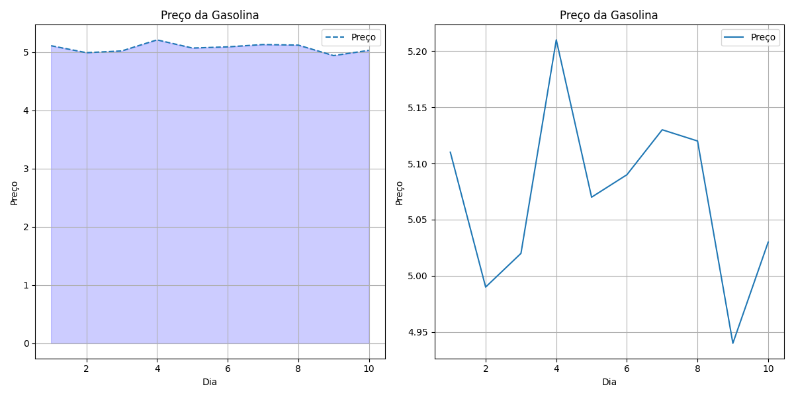

# Análise de Vendas de Gasolina 📊⛽

Este repositório faz parte de um exercício proposto pelo professor André(EBAC) para praticar o uso do Git e GitHub. O objetivo é trabalhar com um arquivo CSV contendo dados de vendas de gasolina e realizar a visualização dessas vendas por dia.

## 📌 O que foi feito:
1. **Leitura do dataset** `gasolina.csv` 📄
2. **Processamento e análise dos dados** usando `pandas`
3. **Plotagem de gráfico** para visualizar as vendas ao longo dos dias (`matplotlib` e `seaborn`)
4. **Commit do código Python** que gera a análise (`.py`)
5. **Commit da imagem do gráfico gerado** (`.png`)
6. **Atualização deste README** com a explicação do processo

## 📊 Visualização:
A seguir, está um exemplo do gráfico gerado a partir dos dados de vendas de gasolina:



## 🚀 Tecnologias utilizadas:
- `Python`
- `Pandas`
- `Matplotlib`
- `Seaborn`
- `Git/GitHub`

## 📌 Como executar o código:
1. Clone o repositório:
   ```bash
   git clone https://github.com/rubensgtavares/da-ebac.git
   ```

2. Navegue até o diretório do repositório:
   ```bash
   cd da-ebac
   ``` 

3. Execute o código Python:
   ```bash
   python gasolina.py
   ```


